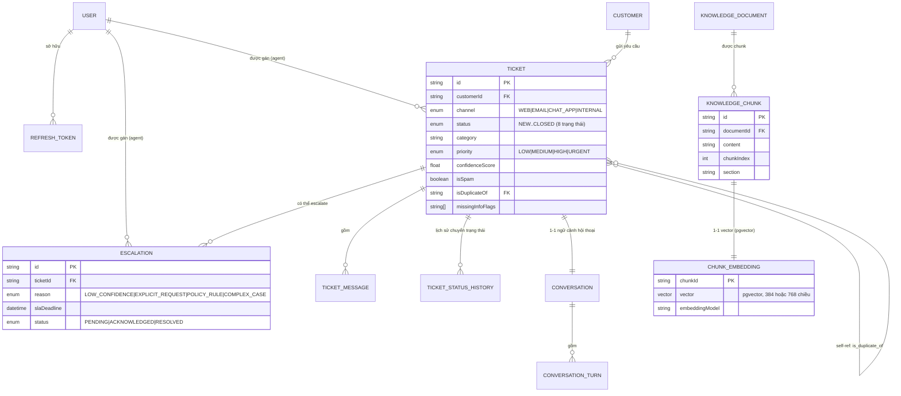

# Automation Agent — Hệ thống Tự động hoá Hỗ trợ Khách hàng bằng AI (Link Demo: https://automation-agent-fhbl.onrender.com)

Backend API cho hệ thống Automation/Agent tiếp nhận yêu cầu từ **nhiều kênh** (Web Chat, Telegram, Gmail/Email), tự động phân loại — phát hiện spam/trùng lặp/thiếu thông tin — trả lời bằng **RAG** (Retrieval-Augmented Generation) có trích dẫn nguồn, và **tự chuyển cho nhân viên (escalate)** khi độ tin cậy thấp hoặc vượt ngoài phạm vi tri thức đã nạp.

> Dự án không phải 1 chatbot demo đơn thuần — mỗi quyết định kiến trúc (Clean Architecture, Channel Adapter Pattern, Hybrid Search + RRF, Confidence Scoring đa tín hiệu, Saga đơn giản cho AI pipeline) đều xuất phát từ yêu cầu thật của bài toán Automation/Agent, được ghi chú trực tiếp trong code và trong `TDD-Track-D-AI-Customer-Support.md`.

---

## Mục lục

- [Kiến trúc tổng quan](#kiến-trúc-tổng-quan)
- [Sơ đồ dữ liệu (ERD)](#sơ-đồ-dữ-liệu-erd)
- [Tech Stack](#tech-stack)
- [Tính năng chính](#tính-năng-chính)
- [Cấu trúc thư mục](#cấu-trúc-thư-mục)
- [Cài đặt & Chạy thử](#cài-đặt--chạy-thử)
- [Biến môi trường](#biến-môi-trường)
- [Testing](#testing)
- [Monitoring](#monitoring)
- [Giới hạn đã biết](#giới-hạn-đã-biết)
- [Tài liệu liên quan](#tài-liệu-liên-quan)

---

## Kiến trúc tổng quan

```
                Web Chat / Telegram Bot / Gmail (IMAP) / Mailgun Webhook
                                    │
                                    ▼  (Channel Adapter Pattern — 1 Use Case duy nhất)
┌──────────────────────────────────────────────────────────────────────┐
│                  NestJS Modular Monolith (apps/api)                  │
│  Presentation → Application (Use Case/CQRS) → Domain → Infrastructure│
│                                                                      │
│  Identity | Customer | Ticket | Conversation | KnowledgeBase | RAG   │
│  AI (Orchestrator) | Routing | Escalation | Notification | Audit     │
│  Dashboard | Monitoring | Analytics | Settings | Shared              │
└───────────┬───────────────────────────────────────┬──────────────────┘
            │                                        │
            ▼                                        ▼
   ┌─────────────────┐                     ┌───────────────────────┐
   │   PostgreSQL    │                     │   Redis (BullMQ)      │
   │  (+ pgvector)   │                     │  Queues + Cache       │
   └─────────────────┘                     └──────────┬────────────┘
                                                        │
                                                        ▼
                                         ┌──────────────────────────────┐
                                         │  apps/worker (process riêng, │
                                         │  cùng codebase libs/)        │
                                         │  Document Parser / Embedding │
                                         │  / Email / Notification /    │
                                         │  Analytics cron / SLA Watcher│
                                         └──────────┬───────────────────┘
                                                     │
                          ┌──────────────────────────┼─────────────────────────┐
                          ▼                          ▼                         ▼
                 ┌─────────────────┐      ┌────────────────────┐      ┌────────────────────┐
                 │ Groq / Gemini   │      │ Local Embedding    │      │ Cloudinary / Local │
                 │ (LLM, fallback) │      │ (bge-small-en-v1.5)│      │ File Storage       │
                 └─────────────────┘      └────────────────────┘      └────────────────────┘
```

**Nguyên tắc kiến trúc:**
- **Clean Architecture 4 lớp** (Presentation → Application → Domain → Infrastructure), luật phụ thuộc luôn hướng vào trong; Domain không import gì từ Infrastructure.
- **Modular Monolith / feature-first**: mỗi bounded context (Ticket, RAG, AI, Escalation...) là 1 module tự chứa, giao tiếp liên module chỉ qua Facade export tường minh hoặc Domain Event (`EventEmitter2`) — sẵn sàng tách Microservices sau này mà không phải viết lại business logic.
- **API và Worker dùng chung 1 codebase** (`libs/`), khác nhau chỉ ở entrypoint (`apps/api/main.ts` vs `apps/worker/worker.main.ts`) — tránh trùng lặp logic, scale độc lập từng process.
- **Channel Adapter Pattern**: mọi kênh tiếp nhận (Web/Telegram/Gmail/Email webhook) hội tụ về đúng 1 `CreateTicketUseCase`, không rẽ nhánh business logic theo kênh.
- **Port/Adapter cho LLM & Embedding**: `ILlmProvider`/`IEmbeddingProvider` do Application/Domain định nghĩa, Infrastructure implement (Groq/Gemini/Local) — đổi provider không sửa business logic.

---

## Sơ đồ dữ liệu (ERD)



17 bảng nghiệp vụ, chia nhóm: Identity, Customer/Ticket/Conversation, Knowledge Base/RAG, AI (PromptLog), Routing/Escalation, Vận hành (Notification/Audit/Analytics). Chi tiết đầy đủ và lý do thiết kế từng bảng xem `prisma/schema.prisma` và Mục 10 của `TDD-Track-D-AI-Customer-Support.md`.

---

## Tech Stack

| Nhóm | Công nghệ | Vai trò |
|---|---|---|
| Backend Framework | NestJS + TypeScript (strict) | DI container, module system khớp Clean Architecture |
| Database | PostgreSQL + **pgvector** | Dữ liệu quan hệ + vector cùng 1 instance, transaction nhất quán |
| ORM | Prisma | Type-safe, migration, raw SQL cho phần vector/full-text search |
| Queue | BullMQ + Redis (ioredis) | Background job: parse tài liệu, embedding, gửi email, notification |
| LLM | Groq (Llama 3.3, primary) + Google Gemini (fallback) | `LlmOrchestratorProvider` tự chuyển provider khi rate-limit/lỗi |
| Embedding | `bge-small-en-v1.5` chạy local qua `@xenova/transformers` (mặc định) hoặc Gemini `text-embedding-004` | Không phụ thuộc rate-limit ngoài, tiết kiệm quota cho phần generation |
| Auth | JWT (access 15p + refresh token rotation, opaque `id.secret`) | RBAC 3 role: ADMIN / AGENT / VIEWER |
| File Storage | Cloudinary (`resource_type: raw`) hoặc Local Filesystem | Lưu tài liệu Knowledge Base gốc (PDF/DOCX/TXT/MD) |
| Kênh tiếp nhận | Web REST, Telegram Bot API, Gmail (IMAP polling + SMTP), Mailgun Inbound Webhook | Channel Adapter Pattern — cùng hội tụ 1 Use Case |
| Observability | Prometheus (`prom-client`) + Grafana, `nestjs-pino` (structured JSON log) | `/health`, `/health/ready`, `/metrics` |
| Testing | Jest, ts-jest | Unit test cho Domain Entity + Use Case (mock port) |
| Containerization | Docker Compose (Postgres + pgvector, Redis) | Chuẩn hoá môi trường dev |

---

## Tính năng chính

### Đa kênh (Multi-channel)
- **Web** (Must-have): REST API + Web Chat Widget, khách hàng không cần đăng nhập.
- **Telegram** (Should-have): webhook nhận/gửi tin nhắn qua Bot API.
- **Gmail** (Could-have): polling IMAP mỗi 2 phút, lọc email tự động/hệ thống, trả lời qua SMTP (gửi bất đồng bộ qua Email Worker để không tranh CPU với AI pipeline).
- **Mailgun Inbound Webhook** (Could-have): nhận email qua route forward.

### AI Processing Pipeline (`ProcessIncomingMessageUseCase`)
Classification → Spam Detection → Duplicate Detection (Jaccard similarity trong 30 ngày) → Missing Info Detection → Priority Detection → RAG Answer Generation → Confidence Evaluation → Routing Decision → Auto-answer hoặc Escalate. Toàn bộ chạy như 1 "Saga đơn giản, đồng bộ trong request"; ghi `PromptLog` bất đồng bộ để không chặn response time.

### RAG Pipeline (Enterprise-grade)
- **Chunking**: Recursive Character Splitting, ưu tiên ranh giới đoạn văn → câu → từ, giữ heading Markdown làm metadata `section`.
- **Hybrid Search**: kết hợp Vector Similarity (pgvector cosine) + Full-text Search (Postgres `tsvector`) bằng **Reciprocal Rank Fusion (RRF)**.
- **Re-ranking**: LLM chấm điểm relevance 0-10 cho top-N candidate, tự fallback về thứ tự RRF nếu LLM lỗi (không chặn pipeline).
- **Confidence Scoring đa tín hiệu**: `0.5×avgTopSimilarity + 0.3×retrievalCoverage + 0.2×llmSelfScore` — không tin tuyệt đối vào LLM tự chấm điểm.
- **Chống hallucination**: nếu không tìm được chunk liên quan, trả thẳng "không tìm thấy thông tin" thay vì để LLM tự bịa, đồng thời escalate.

### Routing & Escalation
- Rule engine config-driven (ngưỡng confidence qua env `AI_CONFIDENCE_ESCALATION_THRESHOLD`).
- `Escalation` có SLA riêng (mặc định 24h), `SlaWatcherService` quét mỗi 5 phút để phát cảnh báo quá hạn.
- Agent Acknowledge → `IN_PROGRESS`; Resolve → đồng bộ cả Ticket sang `RESOLVED`.

### Vận hành & Quan sát
- **Audit Log** append-only, subscribe toàn bộ Domain Event qua wildcard listener (`@OnEvent('**')`).
- **Dashboard**: tổng quan ticket theo status/priority, xu hướng theo ngày (Analytics Worker materialize sẵn), tỷ lệ AI tự trả lời vs escalate.
- **Notification**: email cho Agent/Admin khi có Escalation mới, tài liệu xử lý lỗi, hoặc SLA breach — gửi bất đồng bộ qua Queue.
- **Monitoring**: `/metrics` (Prometheus) — `http_request_duration_seconds`, `queue_length`, `llm_call_duration_seconds`, `ai_confidence_score`, `tickets_created_total`, `tickets_escalated_total`.

---

## Cấu trúc thư mục

```
automation-agent/
├── apps/
│   ├── api/            # HTTP entrypoint (NestJS)
│   └── worker/          # Worker process (BullMQ processors + cron)
├── libs/
│   ├── modules/         # 17 module nghiệp vụ, mỗi module đủ 4 lớp Clean Architecture
│   ├── shared/           # Base Entity/VO, Result type, error codes, exception filter
│   ├── config/           # Zod env validation, config namespaces
│   └── infrastructure/   # PrismaService, Redis/Queue, LLM adapters, Storage adapters
├── workers/               # BullMQ Processor (adapter kích hoạt Use Case, không chứa business logic)
├── prisma/               # schema.prisma, migrations, seed.ts
├── docker/                # docker-compose.yml, init-extensions.sql (pgvector)
├── storage/               # Tài liệu KB mẫu (seed demo)
└── test/unit/             # Unit test theo module (mock port)
```

Chi tiết lý do tổ chức từng thư mục xem Mục 6 của `TDD-Track-D-AI-Customer-Support.md`.

---

## Cài đặt & Chạy thử

### Yêu cầu
- Node.js ≥ 20
- Docker Desktop (chạy Postgres + Redis local)
- API key free: [Groq](https://console.groq.com), [Google AI Studio](https://aistudio.google.com) (Gemini fallback + embedding tuỳ chọn)

### Chạy local (dev)
```bash
git clone <repo-url> automation-agent
cd automation-agent
npm install

cp .env.example .env
# → điền JWT_ACCESS_SECRET / JWT_REFRESH_SECRET (chuỗi ngẫu nhiên ≥32 ký tự, vd: openssl rand -base64 48)
# → điền GROQ_API_KEY / GEMINI_API_KEY nếu muốn chạy AI pipeline thật

docker compose -f docker/docker-compose.yml up -d (đã có Neon và Upstash nên không cần chạy lệnh này)

npm run prisma:generate
npm run prisma:migrate:deploy (vui lòng không chạy lệnh này vì hiện đang có database của neon)   # hoặc prisma:migrate:dev khi phát triển thêm
npm run seed    (vui lòng không chạy lệnh này vì hiện đang có database của neon)                 # tạo admin@example.com / ChangeMe123!

npm run start:dev               # API tại http://localhost:3000/api
npm run start:worker:dev        # Worker process (queue: document-parser, embedding, email, notification)
```

### Thử nhanh bằng curl hoặc postman ( link postman https://go.postman.co/workspace/8f65c004-6c33-45cb-8e29-6e5558d375be Nếu sài Postman bằng link nhớ phải vào thêm vào Enviroment URL: base_url: http://localhost:3000 , url_main: https://automation-agent-fhbl.onrender.com )
```bash
# Đăng nhập
curl -X POST http://localhost:3000/api/auth/login \
  -H "Content-Type: application/json" \
  -d '{"email":"admin@example.com","password":"ChangeMe123!"}'

# Tạo ticket qua kênh Web (public, không cần token)
curl -X POST http://localhost:3000/api/tickets \
  -H "Content-Type: application/json" \
  -d '{"customerEmail":"khach@example.com","subject":"Hỏi về đổi trả","content":"Tôi muốn đổi trả đơn hàng SV-20260415"}'
```

Mọi response bọc trong envelope chuẩn `{ success, data, error, meta }`. Mã lỗi tập trung tại `libs/shared/exceptions/error-codes.ts`, map 1-1 sang HTTP status qua Global Exception Filter.

---

## Biến môi trường

| Nhóm | Biến quan trọng | Ghi chú |
|---|---|---|
| App | `PORT`, `API_PREFIX`, `CORS_ORIGIN` | |
| Database | `DATABASE_URL` | Postgres có extension `vector` |
| Redis | `REDIS_HOST`/`REDIS_PORT` hoặc `REDIS_URL` | Dùng cho BullMQ |
| JWT | `JWT_ACCESS_SECRET`, `JWT_REFRESH_SECRET` | Bắt buộc ≥32 ký tự, khác nhau |
| LLM | `GROQ_API_KEY`, `GEMINI_API_KEY`, `GROQ_MODEL`, `GEMINI_MODEL` | Optional lúc boot, throw rõ khi thực sự gọi mà thiếu key |
| Embedding | `EMBEDDING_PROVIDER` (`local`/`gemini`), `EMBEDDING_DIMENSIONS` | |
| RAG | `CHUNK_SIZE_TOKENS`, `RAG_TOP_K_RETRIEVAL`, `RAG_TOP_K_FINAL`, `AI_CONFIDENCE_ESCALATION_THRESHOLD`, `SPAM_SCORE_THRESHOLD` | Config-driven, không hard-code |
| Kênh | `TELEGRAM_BOT_TOKEN`, `GMAIL_USER`/`GMAIL_APP_PASSWORD`, `EMAIL_POLLING_ENABLED` | |
| Storage | `STORAGE_DRIVER` (`local`/`cloudinary`), `CLOUDINARY_*` | |
| Notification | `ADMIN_NOTIFICATION_EMAIL`, `SMTP_*` | Kênh thông báo nội bộ, tách khỏi kênh trả lời khách |

Xem đầy đủ + validate bằng Zod tại `libs/config/env.validation.ts` (fail-fast khi thiếu biến bắt buộc).

---

## Testing

```bash
npm run test
```

Unit test tập trung vào phần khó nhất: `TicketStateMachine`/`Ticket` entity (transition hợp lệ/không hợp lệ), `LoginUseCase` (mock toàn bộ Repository/Port). Chưa phủ 100% — xem `test/unit/`.

---

## Monitoring

`GET /metrics` (Prometheus text format) expose:
- `http_requests_total{method,route,status}`, `http_request_duration_seconds{route}`
- `queue_length{queue}`, `queue_jobs_failed_total{queue}`
- `llm_call_duration_seconds{provider,useCase}`, `ai_confidence_score` (histogram)
- `tickets_created_total{category}`, `tickets_escalated_total{reason}`, `tickets_auto_resolved_total`

`GET /health/ready` kiểm tra kết nối DB + Redis. Import dashboard Grafana mẫu tại `docker/grafana/dashboards` (System Health / AI Performance / Business).

---

## Giới hạn đã biết

Trung thực về phạm vi — hệ thống được thiết kế theo nguyên tắc *"Architecture-complete, Scope-lean"* cho khung thời gian giới hạn, không phải mọi nhánh đều đã implement đầy đủ ở mức Should/Could-have:

- **Gửi Mail** khi muốn gửi mail thì phải gửi cho tài khoản mail hdthinh8@gmail.com, khi muốn nhận mail phản hổi lại thì buộc phải chạy npm run start:worker:dev ở local. Vì khi deploy lên Render Free tier thì Render chặn Port của SMTP nên không thể nào gửi được. Nên khi muốn nhận mail phản hổi thì buộc phải chạy Worker ở local
- **Duplicate Detection** dùng Jaccard similarity trên tập từ (đơn giản hoá), chưa dùng vector similarity qua RAG Module như thiết kế đầy đủ.
- **SLA Watcher** chưa có cờ "đã thông báo" — nếu Escalation vẫn `PENDING` qua nhiều chu kỳ quét (5 phút), thông báo có thể lặp lại tới khi Agent Acknowledge.
- **Kênh Email/Mailgun** mỗi email tạo 1 ticket mới, chưa gộp email cùng chuỗi (`In-Reply-To`) vào 1 ticket cũ.
- **Re-ranking bằng LLM** tiêu tốn thêm 1 lượt gọi LLM cho mỗi câu hỏi — có thể tắt bằng cách để `topKRetrieval ≤ topKFinal` nếu cần tiết kiệm quota free-tier.
- **Free tier LLM (Groq/Gemini)** có thể bị rate-limit ở lượng truy cập cao — đã có fallback chain + escalate tự động khi cả 2 provider cùng lỗi, không để ticket kẹt trạng thái.
- **Worker health-check** trên các nền tảng chỉ hỗ trợ "Web Service" (không có Background Worker miễn phí) cần mở kèm 1 HTTP server tối giản chỉ để pass health-check — không phục vụ nghiệp vụ.

Chi tiết đầy đủ và các quyết định đánh đổi khác xem Mục 15 và Mục 17 (Nhật ký quyết định) của `TDD-Track-D-AI-Customer-Support.md`.

---

## Tài liệu liên quan

- [`TDD-Track-D-AI-Customer-Support.md`] — https://docs.google.com/document/d/1oIeRXqzTY-ehi3EKFmMDApNStNUflb6mWudEdIbrFOU/edit?usp=sharing (tài liệu thiết kế kiến trúc đầy đủ (Clean Architecture, RAG Pipeline, AI Workflow, State Machine, Database, REST API, Background Jobs, Observability, Kế hoạch triển khai theo Phase).
- Frontend Dashboard (project riêng `automation-agent-FE`) — Next.js App Router, xem README của project đó để biết cách kết nối.
